# RunFlow — Roadmap

Prioridades sugeridas para as **10 próximas features**, com base no que o app já faz hoje (gravar treino, importar GPX/FIT, perfil, calorias estimadas, APK Android).

Legenda de esforço: **S** (pequeno) · **M** (médio) · **L** (grande)

---

## 1. Exportar treinos em GPX ✅

**Esforço:** S · **Prioridade:** Alta · **Status:** Concluído

Permitir exportar qualquer atividade gravada ou importada para `.gpx`, para backup ou uso em outros apps (Strava, Komoot, etc.).

- [x] Botão “Exportar GPX” na tela de detalhe do treino
- [x] Compartilhar arquivo no Android (share sheet)
- [x] Download direto no navegador

---

## 2. Gráficos de ritmo, elevação e FC ✅

**Esforço:** M · **Prioridade:** Alta · **Status:** Concluído

Visualizar a evolução ao longo do treino, como no Strava.

- [x] Gráfico de ritmo por km ou por distância
- [x] Gráfico de altitude (quando houver dados)
- [x] Gráfico de frequência cardíaca (treinos FIT)

---

## 3. Metas semanais e progresso ✅

**Esforço:** M · **Prioridade:** Alta · **Status:** Concluído

Motivar uso contínuo com metas configuráveis.

- [x] Meta de distância (km/semana) e/ou número de treinos (Perfil)
- [x] Barra de progresso na home
- [x] Aviso visual ao atingir 100% da meta

---

## 4. Recordes pessoais (PRs) ✅

**Esforço:** M · **Prioridade:** Média · **Status:** Concluído

Destacar melhores marcas automaticamente.

- [x] Maior distância em um treino
- [x] Melhor ritmo médio (distância mínima configurável, ex. 5 km)
- [x] Maior duração / maior elevação
- [x] Badge “PR” (troféu dourado) na lista, detalhe e home

---

## 5. Divisão por voltas / km (splits) ✅

**Esforço:** M · **Prioridade:** Média · **Status:** Concluído

Tabela de parciais automáticos.

- [x] Splits por quilômetro (tempo, ritmo, elevação)
- [x] Exibir na tela de detalhe abaixo do mapa
- [ ] Suporte a voltas manuais (botão “Volta” durante gravação) — pendente/futuro

---

## Extra: Suporte Multilíngue (Português & Inglês) ✅

**Esforço:** M · **Prioridade:** Alta · **Status:** Concluído

Tradução e internacionalização completa do aplicativo para Português (PT) e Inglês (EN).

- [x] Dicionários completos para PT e EN
- [x] Hook de tradução client-side (`useI18n`) e Context Provider
- [x] Configuração e preferência de idioma na tela de Perfil com salvamento dinâmico
- [x] Tradução de toda a interface, gráficos, mapas, e guias de importação

---

## 6. Histórico e estatísticas avançadas

**Esforço:** M · **Prioridade:** Média

Painel além do resumo atual da home.

- Gráfico de volume semanal/mensal (km e tempo)
- Média de ritmo e calorias no período
- Filtro por tipo: corrida, caminhada, ciclismo
- Total acumulado no ano

---

## 7. Tela escura durante gravação (modo treino)

**Esforço:** S · **Prioridade:** Média

Experiência focada enquanto corre.

- UI simplificada: tempo, distância, ritmo em fonte grande
- Manter tela ligada (`Keep Awake`) no Android
- Bloqueio de toques acidentais (opcional)

---

## 8. Backup e restauração de dados

**Esforço:** M · **Prioridade:** Média

Evitar perda ao trocar de celular.

- Exportar backup JSON (atividades + perfil + pontos GPS)
- Importar backup no mesmo ou outro dispositivo
- Opcional: backup automático para pasta do celular

---

## 9. Integração com frequência cardíaca em tempo real

**Esforço:** L · **Prioridade:** Baixa–média

Melhorar gravação e calorias com FC ao vivo.

- Conectar relógio/pulseira via Bluetooth (BLE) — pesquisa por protocolo Amazfit/Zepp
- Alternativa inicial: leitura de sensor BLE genérico (cinta FC)
- Exibir FC ao vivo e salvar no treino gravado

---

## 10. Publicação na Play Store (release assinado)

**Esforço:** M · **Prioridade:** Baixa (quando estável)

Distribuir para mais pessoas sem instalar APK manualmente.

- Build de release assinado (keystore)
- Ícone e splash screen dedicados
- Política de privacidade (dados 100% locais)
- Listagem F-Droid como alternativa open source

---

## 11. Assistente de configuração inicial (Wizard de Boas-vindas) ✅

**Esforço:** S · **Prioridade:** Alta · **Status:** Concluído

Melhorar a experiência de onboarding do usuário logo no primeiro uso do aplicativo.

- [x] Detectar se é o primeiro acesso ao aplicativo (ausência de perfil configurado no IndexedDB)
- [x] Apresentar um modal ou tela passo a passo (Wizard) amigável com design premium dark e glassmorphic
- [x] Solicitar nome, preferência de idioma (com tradução reativa imediata), dados físicos (peso, altura, idade) e metas semanais
- [x] Salvar automaticamente essas informações no perfil para personalização imediata (como o cálculo de calorias dos treinos) e exibir saudação personalizada

---

## 12. Conquistas Pessoais e Analytics de Equipamentos

**Esforço:** S · **Prioridade:** Média · **Dificuldade:** Fácil

Gamificação introspectiva e controle estatístico de tênis/calçados.

- [ ] Criar conquistas baseadas em consistência pessoal e metas
- [ ] Vincular tênis/calçados aos treinos gravados
- [ ] Exibir estatísticas de ritmo médio e projeção de desgaste por tênis

---

## 13. Competidor Virtual / Ghost Runner Offline

**Esforço:** M · **Prioridade:** Média · **Dificuldade:** Média

Correr contra o ritmo de atividades anteriores ou contra uma meta fixa.

- [ ] Comparar distâncias e ritmos acumulados em tempo real com o treino de referência
- [ ] Avisos de voz dinâmicos (Web Speech API / Capacitor TTS) ditando atraso/vantagem em metros ou segundos

---

## 14. Motor de Enriquecimento e Correção de Altimetria

**Esforço:** M · **Prioridade:** Baixa · **Dificuldade:** Média

Melhorar e unificar dados de sensores locais.

- [ ] Mesclar dados de arquivos de GPS (.gpx) com dados de batimentos cardíacos (.fit) de relógios locais
- [ ] Obter altitudes corretas consultando APIs de mapeamento topográfico aberto

---

## 15. Sincronização Multidispositivo Sem Servidor

**Esforço:** L · **Prioridade:** Média · **Dificuldade:** Alta

Manter dados atualizados em vários aparelhos sem usar um banco de dados centralizado do RunFlow.

- [ ] Sincronização local-first com nuvens do usuário (Google Drive, Nextcloud, iCloud)
- [ ] Sincronização via rede local (P2P Wi-Fi Sync) entre computador e celular

---

## 16. Navegação Offline e Alerta de Desvio de Rota

**Esforço:** L · **Prioridade:** Baixa · **Dificuldade:** Alta

Seguir rotas importadas sem conexão à internet.

- [ ] Alertas sonoros instantâneos de fora de rota ("Off-route") baseados em proximidade geométrica
- [ ] Suporte a desenho e criação rápida de trajetos GPX direto no app

---

## 17. Replay e Visualização da Atividade em 3D (Flyover)

**Esforço:** L · **Prioridade:** Baixa · **Dificuldade:** Alta

Uma visualização premium e interativa do percurso.

- [ ] Renderizar o trajeto do treino em 3D (Three.js / WebGL) com dados topográficos locais
- [ ] Animação de câmera (flyover) e mapa de calor de velocidade ao longo da rota

---

## Ideias para depois do top 17

- Modo escuro/claro configurável
- Múltiplos perfis no mesmo aparelho
- Planejamento de treino (ex.: plano 5K / 10K)
- Comparar dois treinos lado a lado
- Widget Android com resumo da semana
- Suporte a TCX além de GPX/FIT
- Zonas de ritmo e FC configuráveis no perfil

---

## Ordem sugerida de implementação

```mermaid
flowchart LR
  F1[1 Exportar GPX] --> F2[2 Gráficos]
  F2 --> F3[3 Metas semanais]
  F3 --> F5[5 Splits]
  F5 --> F4[4 PRs]
  F4 --> F11[11 Wizard]
  F11 --> F6[6 Estatísticas]
  F6 --> F7[7 Modo treino]
  F7 --> F8[8 Backup]
  F8 --> F9[9 FC BLE]
  F9 --> F10[10 Play Store]
  F10 --> F12[12 Conquistas & Gear]
  F12 --> F13[13 Ghost Runner]
  F13 --> F14[14 Enriquecimento]
  F14 --> F15[15 Cloud Sync]
  F15 --> F16[16 Rota Offline]
  F16 --> F17[17 Flyover 3D]
```

| Fase | Features | Objetivo |
|------|----------|----------|
| **v0.2** | 1, 2 | Dados portáveis e análise visual |
| **v0.3** | 3, 4, 5 | Engajamento e detalhe de treino |
| **v0.4** | 11, 6, 7, 8 | Polimento, onboarding e confiança nos dados |
| **v0.5** | 9, 10 | Hardware e distribuição |
| **v0.6+** | 12, 13, 14 | Gamificação e inteligência local |
| **v0.7+** | 15, 16, 17 | Sincronização avançada e recursos 3D/offline |

---

*Última atualização: maio 2026*

