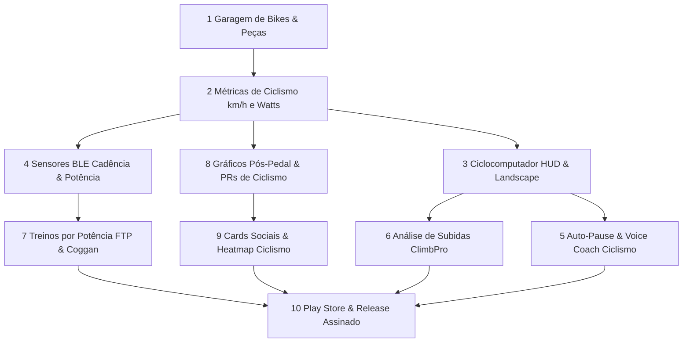

# RunFlow — Roadmap & Benchmark de Mercado

Pesquisa de mercado e análise comparativa baseada nos aplicativos líderes da categoria (**Strava**, **Garmin Connect / Edge**, **Wahoo Fitness**, **Komoot**, **Nike Run Club - NRC** e **Bikemap**), mantendo o compromisso central do RunFlow: **100% offline, local-first, gratuito e com privacidade total de dados**.

---

## 🏆 Benchmark de Mercado & Tendências — Ciclismo & Multi-Esporte (2025–2026)

| Aplicativo | Pontos Fortes em UI/UX & Ciclismo | O que o RunFlow oferece / supera |
|---|---|---|
| **Strava** | • Métricas de velocidade em km/h e potência estimada • Cadastro de Bikes e componentes • Heatmaps e Segmentos | • No Strava, recursos analíticos e heatmaps são pagos ($$$). No RunFlow, tudo é 100% gratuito e local. • Cards de Stories sem marcas de paywall. |
| **Garmin Connect / Edge** | • Sensores BLE de Cadência (RPM) e Potência (Watts) • Zonas de Potência (Coggan) e Zonas de FC (Z1-Z5) • Análise de subidas em tempo real (ClimbPro) | • Transformar qualquer smartphone em um ciclocomputador GPS completo com sensores BLE sem exigir aparelhos caros. |
| **Wahoo Fitness & Cadence** | • Tela de Ciclocomputador limpa com números grandes • Modo Paisagem (Landscape) para suporte de guidão • Avisos de voz configuráveis para ciclismo | • HUD de alto contraste (Outdoor Sun Mode) otimizado para sol direto no guidão da bicicleta. |
| **Komoot & Bikemap** | • Perfil altimétrico de elevação da rota • Alertas de manutenção preventiva de bike por quilometragem | • Gestão completa da garagem de bikes com histórico de desgaste de corrente, pneus e pastilhas. |

---

## 📊 Status Geral do Projeto (Fases Anteriores Concluídas)

| Fase | Descrição | Status |
|---|---|---|
| **Fase 1.0: Core do App** | Importação GPX/FIT, Altimetria, Splits, PRs, Gráficos, BLE HR, Metas, Dashboard Anual | ✅ 100% Concluído |
| **Fase 2.0: Avançada** | Sincronização P2P/WebDAV, Navegação Offline, Flyover 3D, Card Social, Voice Coach, Auto-Pause, Heatmap Térmico, Treinos Intervalados, VO2 Max, Micro-Interações Táteis & Modo Sol | ✅ 100% Concluído |

---

# 🚴 Fase 3.0: Ecossistema de Ciclismo & Publicação (10 Etapas)

---

### 1. Garagem de Bicicletas & Manutenção Preventiva (Bike Garage & Components)
**Esforço:** M · **Prioridade:** Alta · **Inspiração:** Strava Gear / ProBikeGarage · **Status:** ✅ Concluído

Evoluir o cadastro de equipamentos para uma Garagem Completa de Bicicletas com controle de desgaste de componentes mecânicos.

- [x] Cadastro de Bikes: Tipos (Speed / Road, MTB, Gravel, Urbana, E-Bike, Dobrável), Marca, Modelo, Ano, Peso da bike (kg) e Foto/Ícone
- [x] Rastreamento de componentes com limite de vida útil (km) e alertas preventivos:
  - Corrente (ex.: alerta de troca com 2.500 km)
  - Pneus dianteiro e traseiro (ex.: 4.000 km)
  - Pastilhas/Sapatas de freio (ex.: 3.000 km)
  - Fluido / Sangria de freios e Revisão Geral (ex.: 6 meses / 5.000 km)
- [x] Associação da bike padrão para pedais e transferência de quilometragem automática
- [x] Hodômetro acumulado e histórico de manutenção por bicicleta

---

### 2. Motor de Métricas de Ciclismo (Velocidade km/h, Potência Estimada & Inclinação)
**Esforço:** M · **Prioridade:** Alta · **Inspiração:** Strava / GoldenCheetah · **Status:** ✅ Concluído

Cálculo científico de métricas de ciclismo em tempo real e pós-treino.

- [x] Alternância automática entre Ritmo (min/km para corrida) e **Velocidade (km/h)** para ciclismo
- [x] Cálculo de Velocidade Instantânea, Média e Máxima em km/h com suavização por GPS
- [x] Estimativa de Potência em Watts ($P_{\text{total}} = P_{\text{aero}} + P_{\text{climb}} + P_{\text{rolling}}$) baseada no peso combinado (ciclista + bike), velocidade, inclinação e coeficiente aerodinâmico
- [x] VAM (Velocidade Ascensional Média em m/h) e cálculo de inclinação percentual do terreno (% grade)
- [x] Potência Normalizada (NP™ de Coggan) e gráficos dedicados de Velocidade e Potência por elevação/distância

---

### 3. Ciclocomputador & HUD de Guidão (Bike Computer HUD & Modo Paisagem)
**Esforço:** M · **Prioridade:** Alta · **Inspiração:** Wahoo Elemnt / Garmin Edge / Cadence · **Status:** ✅ Concluído

Transformar o smartphone em um ciclocomputador profissional para fixação no guidão da bicicleta.

- [x] Interface de gravação de ciclismo com campos de alta legibilidade e tipografia extra grande
- [x] Suporte nativo ao **Modo Paisagem (Horizontal / Landscape)** e Modo Retrato com rotação dinâmica e mini-mapa split
- [x] Botões táteis aumentados (Glove Bar 64px+) para fácil acionamento durante a pedalada (mesmo com luvas de ciclismo)
- [x] Compatibilidade integrada com 3 temas: **☀️ Modo Sol (Outdoor E-Ink)**, **🌙 Modo Noite (AMOLED Dark)** e **⚡ Modo Neo**
- [x] Modo Bloqueio de Toque (Proteção contra Suor e Chuva) com destravamento por pressão sustentada de 1.5s
- [x] Suporte a Voltas Manuais (Manual Laps) com exibição de banner instantâneo e estatísticas da volta

---

### 4. Conexão com Sensores BLE de Ciclismo (Cadência, Velocidade & Potência) — ✅ Concluído
**Esforço:** L · **Prioridade:** Média–Alta · **Inspiração:** Garmin Edge / Wahoo

Comunicação direta com sensores Bluetooth Low Energy específicos de bicicleta sem necessidade de internet via `@capacitor-community/bluetooth-le`.

- [x] Suporte ao serviço BLE padrão de **Cycling Speed and Cadence (CSCS - 0x1816)**:
  - Sensor de Cadência de Pedivela (RPM - Rotações por Minuto) com parser stateful (`CSCParser`)
  - Sensor de Velocidade de Roda/Cubo (com suporte a cálculo de deltas de revolução e rollover uint16/uint32)
- [x] Suporte completo ao serviço BLE de **Cycling Power (CPS - 0x1818)** para medidores de potência (Power Meters):
  - Potência Instantânea em Watts com parser stateful (`CyclingPowerParser`)
  - Cadência integrada de pedivelas com medidor de potência (Crank Revolution data)
  - Prioridade automática: Potência real do sensor > Potência estimada por física
- [x] Cards visuais dedicados de pareamento BLE na tela de pré-gravação (somente para Ciclismo)
- [x] Telemetria de cadência e potência em tempo real no Ciclocomputador HUD (Retrato & Paisagem) com badges de status e fonte
- [x] Gravação e persistência de RPM e Watts nos trackpoints e resumo consolidado pós-pedal (`avgCadenceRpm`, `maxCadenceRpm`, `avgWatts`, `maxWatts`)

---

### 5. Auto-Pause & Voice Coach Específicos para Ciclismo ✅
**Esforço:** S · **Prioridade:** Média · **Inspiração:** Strava / NRC

Adaptação dos assistentes automáticos para a dinâmica de velocidade do ciclismo.

- [x] Perfil de sensibilidade do Auto-Pause para Bike (paradas em semáforos, cruzamentos urbanos e descidas com velocidade < 4.0 km/h a 6.0 km/h: Ciclismo Urbano 5.0 km/h, Estrada 7.0 km/h, MTB 3.5 km/h)
- [x] Voice Coach com intervalos estendidos para ciclismo (a cada 5 km, 10 km, 15 km, 20 km ou a cada 5, 10, 15, 20, 30 min)
- [x] Métricas faladas em voz natural: Velocidade média e atual em km/h, Cadência em RPM, Potência em Watts, FC atual (bpm), Zona FC e Ganho de Elevação acumulado
- [x] Avisos sonoros contextuais por modalidade ("Pedal pausado automaticamente" / "Pedal retomado")

---

### 6. Análise de Subidas & Perfil de Altimetria ao Vivo (ClimbPro / Live Elevation)
**Esforço:** M · **Prioridade:** Média · **Inspiração:** Garmin ClimbPro / Hammerhead Karoo

Visualização da altimetria da rota durante a pedalada para gerenciamento de esforço em subidas.

- [ ] Algoritmo de detecção e classificação de subidas por categoria (Cat 4, Cat 3, Cat 2, Cat 1, HC) usando o índice de esforço de subida
- [ ] Mini display de perfil de elevação ao vivo na tela de gravação com marcador de posição atual
- [ ] Alertas visuais e sonoros ao iniciar uma subida categorizada (*"Início da subida: 1.8 km @ 6.5% de inclinação"*)

---

### 7. Treinos Estruturados de Ciclismo & Zonas de Potência (Watts / FTP / Coggan)
**Esforço:** M · **Prioridade:** Média · **Inspiração:** TrainerRoad / TrainingPeaks / Zwift

Treinos intervalados orientados a potência (Watts) e cadência (RPM).

- [ ] Configuração de FTP (Functional Threshold Power em Watts) no perfil do ciclista
- [ ] 7 Zonas de Potência clássicas de Andrew Coggan (Z1 Recuperação Ativa até Z7 Potência Neuromuscular)
- [ ] Presets de treinos intervalados de ciclismo: *Sprints de Cadência (High Cadence Drills)*, *Tiros VO2 Max (3x 3min)*, *Sweet Spot (2x 15min)* e *Resistência Z2*

---

### 8. Gráficos Avançados & Análise Pós-Pedal (Power Curve, Cadence & Altimetria)
**Esforço:** M · **Prioridade:** Média · **Inspiração:** Strava Summit / Intervals.icu

Aprofundamento analítico na tela de detalhes de treinos de ciclismo.

- [ ] Gráficos interativos sincronizados de Velocidade (km/h), Elevação (m), Cadência (RPM) e Potência (Watts)
- [ ] Distribuição de tempo em Zonas de Potência (Z1–Z7) e Zonas de FC (Z1–Z5)
- [ ] Recordes Pessoais (PRs) exclusivos de Ciclismo: Maior Distância, Maior Velocidade Média, Velocidade Máxima, Maior Altimetria e Melhor Potência
- [ ] Curva de Potência Crítica (Melhores Esforços de Potência: 5s, 30s, 1min, 5min, 20min, 60min)

---

### 9. Cards Sociais & Heatmap Térmico Dedicados para Ciclismo
**Esforço:** S · **Prioridade:** Média · **Inspiração:** Strava / Instagram

Celebração visual e mapeamento térmico de rotas de pedal.

- [ ] Cards de compartilhamento social (Stories 9:16 e Feed 1:1) com layout e dados específicos de ciclismo (Velocidade Média km/h, Máx km/h, Altimetria, Foto da Bike)
- [ ] Filtro dedicado no Mapa de Calor Pessoal (Heatmap) para visualizar exclusivamente a malha viária pedalada

---

### 10. Publicação na Play Store & Release Final Assinado (Fase Final de Distribuição)
**Esforço:** M · **Prioridade:** Conclusão do Ciclo de Lançamento

Preparação de produção para distribuição pública do RunFlow como app multi-esporte de corrida e ciclismo.

- [ ] Geração de chave de assinatura `keystore` criptografada para builds de produção
- [ ] Configuração do Gradle para build de **Android App Bundle (`.aab`)** otimizado com Proguard/R8 para a Google Play Store
- [ ] Geração de APK de Release assinado para download direto (GitHub Releases / F-Droid)
- [ ] Ícones adaptativos em alta resolução (Adaptive Icons para Android 13+) e splash screen nativa
- [ ] Documento formal de Política de Privacidade Local-First (declaração de dados 100% locais sem telemetria externa)

---

## 🗺️ Fluxograma de Dependências da Fase 3.0

*Última atualização: agosto 2026 — Início da Fase 3.0: Ecossistema de Ciclismo & Lançamento*
