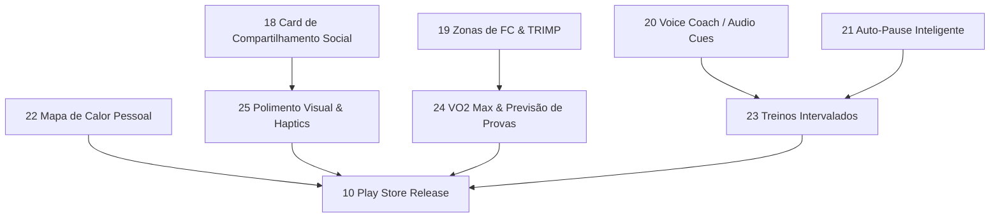

# RunFlow — Roadmap & Benchmark de Mercado

Pesquisa de mercado e análise comparativa baseada nos aplicativos líderes da categoria (**Strava**, **Adidas Running / Runtastic**, **Nike Run Club - NRC** e **Garmin Connect**), mantendo o compromisso central do RunFlow: **100% offline, local-first, gratuito e com privacidade total de dados**.

---

## 🏆 Benchmark de Mercado & Tendências (2025–2026)

| Aplicativo | Pontos Fortes em UI/UX & Features | O que o RunFlow pode aprender / superar |
|---|---|---|
| **Strava** | • Cards de compartilhamento social belíssimos • Heatmaps pessoais sobrepostos • Análise detalhada de ritmo e segmentos | • No Strava, Heatmaps e análises profundas são pagos ($$$). No RunFlow, tudo é 100% gratuito e local. • Compartilhamento visual direto para Instagram Stories sem marcas forçadas. |
| **Adidas Running** | • Gamificação com streaks de chamas 🔥 • Treinos intervalados guiados com áudio • Design clean com foco no botão de início | • Feedback tátil e sonoro durante o treino. • Contador visual de consistência semanal na Home. |
| **Nike Run Club (NRC)** | • Foco em superar a si mesmo (Past Self) • Feedback de voz (Audio Cues) fluido e motivador • Planos de treino estruturados e gratuitos | • Avisos por voz configuráveis (tempo/distância/FC/pace). • Previsões de prova e metas claras de evolução. |
| **Garmin Connect** | • Zonas de Frequência Cardíaca (Z1-Z5) detalhadas • Carga de treino cardiovascular (TRIMP/Stress) • Estimativa de VO2 Max e previsão de provas (5K, 10K, 21K, 42K) | • Trazer a profundidade métrica dos relógios Garmin direto para o celular sem precisar de hardware caro ou nuvem proprietária. |

---

## 🚀 Status das Features Implementadas (Top 1–17)

| Feature | Descrição | Status |
|---|---|---|
| **1. Exportar treinos em GPX** | Download direto e compartilhamento nativo no Android | ✅ Concluído |
| **2. Gráficos de ritmo, elevação e FC** | Gráficos interativos com hover e dados detalhados | ✅ Concluído |
| **3. Metas semanais e progresso** | Metas de distância e quantidade com barras de progresso | ✅ Concluído |
| **4. Recordes pessoais (PRs)** | Troféus automáticos para melhores marcas (ritmo, distância, duração) | ✅ Concluído |
| **5. Splits por km** | Parciais de tempo, ritmo e elevação quilômetro a quilômetro | ✅ Concluído |
| **Extra: Internacionalização (PT & EN)** | Suporte completo a múltiplos idiomas com troca instantânea | ✅ Concluído |
| **6. Histórico e estatísticas avançadas** | Painel acumulado anual com filtros por período e esporte | ✅ Concluído |
| **7. Modo treino com tela escura** | Interface de alta visibilidade com Screen Wake Lock | ✅ Concluído |
| **8. Backup e restauração de dados** | Exportação e importação de JSON completo sem perdas | ✅ Concluído |
| **9. Integração com FC ao vivo (BLE)** | Conexão com cintas cardíacas e smartwatches via Bluetooth LE | ✅ Concluído |
| **11. Assistente Wizard de Onboarding** | Configuração guiada em 3 passos no primeiro acesso | ✅ Concluído |
| **12. Conquistas & Analytics de Tênis** | 10 insígnias dinâmicas e controle de desgaste de calçados | ✅ Concluído |
| **13. Competidor Virtual (Ghost Runner)** | Comparação em tempo real com atividades anteriores e alertas TTS | ✅ Concluído |
| **14. Correção e Enriquecimento Topográfico** | Merge de altimetria aberta e junção de GPX com FC de FITs | ✅ Concluído |
| **15. Sincronização Multidispositivo P2P & WebDAV** | Sincronização direta por WebRTC e nuvens privadas sem servidor central | ✅ Concluído |
| **16. Navegação Offline & Alerta de Desvio** | Alertas sonoros/visuais ao sair da rota e criador de trajetos no mapa | ✅ Concluído |
| **17. Replay e Flyover 3D** | Visualização imersiva 3D com WebGL/Three.js, 3 câmeras e telemetria | ✅ Concluído |

---

## 🎯 Novo Roadmap: Próximas 8 Features Prioritárias (Fase 2.0)

Legenda de esforço: **S** (pequeno: 1-2 dias) · **M** (médio: 3-5 dias) · **L** (grande: 1-2 semanas)

---

### 18. Gerador de Card de Compartilhamento Social (Stories & Feed)
**Esforço:** M · **Prioridade:** Alta · **Inspiração:** Strava / NRC

Permitir que o corredor crie imagens estilizadas com os dados do treino para postar no Instagram Stories, WhatsApp, Strava ou salvar na galeria.

- [ ] Motor de renderização local via HTML5 Canvas / SVG (sem envio para servidor)
- [ ] 4 temas visuais: *Dark Cyberpunk/Neon*, *Minimalist Clean*, *Sunset Flow*, *Topo Map Contour*
- [ ] Opção de usar o mapa traçado em gradiente ou carregar uma foto da galeria como plano de fundo
- [ ] Exibição harmônica de dados: Distância, Ritmo Médio, Duração, Ganho de Elevação e FC Média
- [ ] Proporções: 9:16 (Instagram Stories / WhatsApp Status) e 1:1 (Feed)
- [ ] Botão de compartilhamento nativo via Capacitor Share / Web Share API

---

### 19. Zonas de Frequência Cardíaca (Z1–Z5) & Análise de Carga de Treino
**Esforço:** M · **Prioridade:** Alta · **Inspiração:** Garmin Connect / Strava Summit

Aprofundar a análise cardiovascular dos treinos com dados de batimentos cardíacos (BLE ou importados via FIT).

- [ ] Configuração de FC Máxima e FC de Repouso no Perfil (com cálculo automático via Tanaka/Karvonen)
- [ ] Distribuição de tempo e % gasto nas 5 Zonas (Z1 Recuperação, Z2 Base Aeróbica, Z3 Ritmo, Z4 Limiar, Z5 Anaeróbico)
- [ ] Gráfico de barras horizontais colorido na tela de detalhe da atividade
- [ ] Cálculo da Carga Cardiovascular (TRIMP - Training Impulse / Training Load)
- [ ] Indicador de impacto do treino (ex.: "Treino Regenerativo", "Desenvolvimento Aeróbico", "Treino de Limiar")

---

### 20. Assistente de Voz em Tempo Real (Audio Cues / Voice Coach)
**Esforço:** M · **Prioridade:** Alta · **Inspiração:** Nike Run Club / Adidas Running

Feedback em áudio periódico nos fones de ouvido durante a corrida sem precisar olhar para a tela do celular.

- [ ] Síntese de voz nativa e offline usando a Web Speech API / Capacitor TTS
- [ ] Gatilho configurável: Por distância (ex.: a cada 500m, 1km, 2km) ou Por tempo (ex.: a cada 3min, 5min, 10min)
- [ ] Métricas faladas customizáveis: *"Distância total: 4 km. Ritmo médio: 5:15 por km. Frequência cardíaca: 148 bpm."*
- [ ] Alerta especial de split de quilômetro mais rápido do treino
- [ ] Suporte completo aos idiomas Português (PT-BR) e Inglês (EN-US)

---

### 21. Auto-Pause Inteligente & Detecção Automática de Paradas
**Esforço:** S · **Prioridade:** Média · **Inspiração:** Strava / Garmin

Pausar o cronômetro automaticamente ao parar em semáforos ou cruzamentos urbanos, evitando distorções no ritmo médio.

- [ ] Algoritmo de detecção de velocidade mínima (< 1.5 km/h por mais de 3 segundos consecutivos)
- [ ] Distinção clara entre Tempo Total Decorrido (Elapsed Time) e Tempo em Movimento (Moving Time)
- [ ] Ritmo Médio baseado exclusivamente no tempo em movimento
- [ ] Opção ativável/desativável na tela de gravação ou nas configurações do perfil
- [ ] Feedback sonoro/vibratório sutil ao pausar e ao retomar

---

### 22. Mapa de Calor Pessoal (Personal Heatmap)
**Esforço:** M · **Prioridade:** Média · **Inspiração:** Strava Summit (Recurso Pro)

Visualizar todas as corridas e rotas já realizadas sobrepostas em um único mapa da cidade, revelando a intensidade das ruas mais percorridas.

- [ ] Renderização local de alta performance com Leaflet.heat / Canvas Layers
- [ ] Gradiente térmico brilhante (azul $\to$ verde $\to$ amarelo $\to$ vermelho/neon)
- [ ] Filtros interativos: Por ano (2026, 2025, todos), Por modalidade (Corrida, Caminhada, Ciclismo) ou Por tênis
- [ ] Modo tela cheia interativo com zoom fluido
- [ ] 100% processado no dispositivo, garantindo privacidade absoluta dos locais de treino

---

### 23. Criador de Treinos Estruturados & Intervalados (Interval Builder)
**Esforço:** L · **Prioridade:** Média · **Inspiração:** Garmin Workouts / NRC

Permitir que o corredor crie e execute treinos intervalados (tiros, fartlek, pirâmide) com avisos na tela e por voz.

- [ ] Editor visual de etapas: Aquecimento, Repetições (ex.: $6 \times 400\text{m}$ tiro @ ritmo alvo com $1\text{min}$ descanso) e Desaquecimento
- [ ] Interface de gravação dedicada ao treino estruturado (barra de progresso da série atual, contagem regressiva)
- [ ] Alertas sonoros (bips) e de voz anunciando a transição de cada bloco (*"Início do tiro 2 de 6. Mantenha ritmo abaixo de 4:30!"*)
- [ ] Relatório pós-treino com análise de cumprimento de metas em cada parcial do intervalo

---

### 24. Previsão de Tempo de Prova & Estimativa de VO2 Max Local
**Esforço:** M · **Prioridade:** Baixa–Média · **Inspiração:** Garmin Connect / Runalyze

Estimativas científicas de condicionamento e previsões para distâncias populares baseadas no histórico recente.

- [ ] Estimativa local de VO2 Max calculada a partir do ritmo sustentado e FC cardíaca
- [ ] Previsão de tempo para provas clássicas: **5 km**, **10 km**, **21.1 km (Meia Maratona)** e **42.2 km (Maratona)** usando a fórmula de Peter Riegel
- [ ] Painel de "Idade de Condicionamento Físico" e curva de evolução ao longo dos meses

---

### 25. Polimento Visual Neo-Athletic & Micro-Interações Táteis
**Esforço:** S · **Prioridade:** Média · **Inspiração:** Apple Fitness+ / Adidas Running 2026

Elevar o nível sensorial e visual do aplicativo com animações fluidas e feedback físico.

- [ ] Feedback tátil háptico (Capacitor Haptics) nos botões de Play/Pause, fechamento de split e conquistas
- [ ] Contador de Consistência Semanal (*Streaks*) na Home com ícone de chama animada 🔥 (ex.: "4 semanas seguidas!")
- [ ] Efeito de confetes / celebração visual ao bater um Recorde Pessoal (PR) ou concluir um treino longo
- [ ] Modo de alto contraste / Outdoor Sun Mode na tela de gravação para dias ensolarados

---

### 10. Publicação na Play Store & Release Assinado (Fase Final de Distribuição)
**Esforço:** M · **Prioridade:** Conclusão do Ciclo

- [ ] Geração de chave de assinatura `keystore` protegida
- [ ] Configuração do Gradle para build otimizado de Release (`assembleRelease` / `bundleRelease` AAB)
- [ ] Splash screen nativa adaptativa e ícones nos formatos Android
- [ ] Política de privacidade (declaração de dados 100% locais sem rastreamento)
- [ ] Pacote F-Droid / GitHub Releases como canal open-source

---

## 🗺️ Fluxograma de Dependências da Fase 2.0

*Última atualização: agosto 2026 — Replay e Visualização da Atividade em 3D (Feature 17) concluída*

