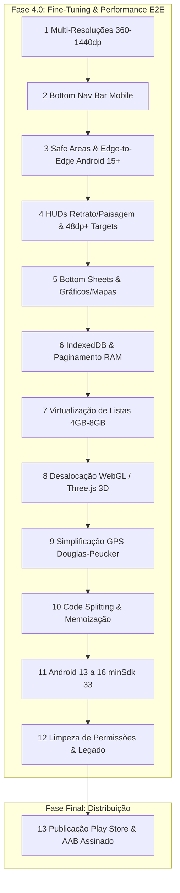

# RunFlow — Roadmap & Benchmark de Mercado

Pesquisa de mercado e análise comparativa baseada nos aplicativos líderes da categoria (**Strava**, **Garmin Connect / Edge**, **Wahoo Fitness**, **Komoot**, **Nike Run Club - NRC** e **Bikemap**), mantendo o compromisso central do RunFlow: **local-first e gratuito**. Treinos e configurações ficam no dispositivo, com Android Auto Backup desabilitado. P2P/WebDAV, tiles de mapa (OpenStreetMap/CARTO/Esri) e correção de altimetria (Open-Meteo) usam rede somente após ação e consentimento explícitos; tiles revelam a área solicitada e a altimetria envia coordenadas exatas.

---

## 🏆 Benchmark de Mercado & Tendências — Ciclismo & Multi-Esporte (2025–2026)

| Aplicativo | Pontos Fortes em UI/UX & Ciclismo | O que o RunFlow oferece / supera |
|---|---|---|
| **Strava** | • Métricas de velocidade em km/h e potência estimada • Cadastro de Bikes e componentes • Heatmaps e Segmentos | • No Strava, recursos analíticos e heatmaps são pagos ($$$). No RunFlow, os dados e recursos analíticos são locais e gratuitos; rede é opt-in para sincronização, tiles e altimetria externa. • Cards de Stories sem marcas de paywall. |
| **Garmin Connect / Edge** | • Sensores BLE de Cadência (RPM) e Potência (Watts) • Zonas de Potência (Coggan) e Zonas de FC (Z1-Z5) • Análise de subidas em tempo real (ClimbPro) | • Transformar qualquer smartphone em um ciclocomputador GPS completo com sensores BLE sem exigir aparelhos caros. |
| **Wahoo Fitness & Cadence** | • Tela de Ciclocomputador limpa com números grandes • Modo Paisagem (Landscape) para suporte de guidão • Avisos de voz configuráveis para ciclismo | • HUD de alto contraste (Outdoor Sun Mode) otimizado para sol direto no guidão da bicicleta. |
| **Komoot & Bikemap** | • Perfil altimétrico de elevação da rota • Alertas de manutenção preventiva de bike por quilometragem | • Gestão completa da garagem de bikes com histórico de desgaste de corrente, pneus e pastilhas. |

---

## 📊 Status Geral do Projeto (Fases Anteriores Concluídas)

| Fase | Descrição | Status |
|---|---|---|
| **Fase 1.0: Core do App** | Importação GPX/FIT, Altimetria, Splits, PRs, Gráficos, BLE HR, Metas, Dashboard Anual | ✅ 100% Concluído |
| **Fase 2.0: Avançada** | Sincronização P2P/WebDAV, navegação local de rotas com tiles online opt-in, Flyover 3D, Card Social, Voice Coach, Auto-Pause, Heatmap Térmico, Treinos Intervalados, VO2 Max, Micro-Interações Táteis & Modo Sol | ✅ Implementação concluída |
| **Fase 3.0: Ecossistema de Ciclismo** | Garagem de Bikes, Potência Watts, Cadência RPM, Velocidade km/h, Ciclocomputador HUD, Sensores BLE (CSCS/CPS), Auto-Pause Ciclismo, ClimbPro, Treinos FTP/Coggan, Curva de Potência e Heatmap Velo | ✅ 100% Concluído |
| **Fase 4.0: Fine-Tuning & Performance** | Implementação visual/performance e Android 13–16; matriz completa, benchmarks formais e hardware físico ainda pendentes | ⚠️ Implementada; validação formal parcial |
| **Fase Final: Publicação** | Google Play Store Release Assinado (.aab, Proguard/R8, Keystore, Data Safety) | ⏳ Próxima |

---

# 🚴 Fase 3.0: Ecossistema de Ciclismo (Concluído)

*(Todas as 9 etapas funcionais de ciclismo concluídas com sucesso: Garagem de Bicicletas, Métricas km/h e Watts, Ciclocomputador HUD Retrato/Paisagem, Sensores BLE CSCS/CPS, Auto-Pause & Voice Coach de Bike, ClimbPro ao Vivo, Treinos Estruturados FTP/Coggan, Curva de Potência e Cards Sociais/Heatmap de Ciclismo).*

---

# 🚀 Fase 4.0: Fine-Tuning, Performance E2E & Android 13 a 16 — ⚠️ Implementação concluída; validação formal parcial

Divisão estratégica em **12 etapas** estruturadas em 3 pilares técnicos fundamentais, antecedendo a publicação oficial.

---

## 🎨 Pilar 1: Fine-Tuning Visual & Multi-Resoluções (5 Etapas) — ⚠️ Implementado; matriz completa pendente

### 1. Design System Responsivo & Multi-Breakpoints (360dp a 1440dp)
**Esforço:** M · **Prioridade:** Alta · **Foco:** Responsividade & Escala · **Status:** ⚠️ Implementado / validação parcial
- [ ] Completar a matriz formal de proporções 16:9, 18:9, 19.5:9, 20:9 e 21:9 entre 360x640 e 1440x3120px; o E2E atual cobre apenas um subconjunto documentado em `docs/quality/current-state.md`
- [x] Tipografia fluida com escala relativa (`clamp()`, `rem`, `dvh`/`dvw`) para evitar overflow horizontal ou corte de telemetria
- [x] Suporte à escala de fonte de acessibilidade do Android (até 200%) em cards estatísticos, listas e modais
- [x] Acessibilidade global no CSS: `prefers-reduced-motion` desativa/anula animações e transições decorativas (mantendo feedback essencial) e `:focus-visible` garante indicador de foco visível com as cores do tema (WCAG 2.2 — 2.3.3 e 2.4.7)

---

### 2. Bottom Navigation Bar Mobile-First & Ergonomia de Polegar
**Esforço:** S · **Prioridade:** Alta · **Foco:** UX / Usabilidade com Uma Mão · **Status:** ✅ Concluído
- [x] Implementação de Bottom Navigation Bar flutuante/fixa para telas mobile (<640px) com os 5 hubs centrais (Início, Atividades, Gravar [Destaque], Rotas, Perfil)
- [x] Preservação do Header espaçado para visualizações desktop, tablets e modo paisagem
- [x] Micro-interações táteis (Haptics) e transições suaves ao alternar entre abas

---

### 3. Safe Area Insets E2E (Android 15+ Edge-to-Edge & Recortes de Tela)
**Esforço:** S · **Prioridade:** Alta · **Foco:** Conformidade com Android 15/16/17 · **Status:** ✅ Concluído
- [x] Conformidade total com a política de Edge-to-Edge mandatória a partir do Android 15 (API 35+)
- [x] Mapeamento dinâmico de `env(safe-area-inset-top)`, `env(safe-area-inset-bottom)`, `env(safe-area-inset-left)` e `right`
- [x] Proteção contra sobreposição da barra de gestos inferior sobre botões de ação e adaptação a recortes de câmera/notch em Paisagem

---

### 4. HUDs de Gravação, Modos Retrato/Paisagem & Touch Targets (48dp+)
**Esforço:** M · **Prioridade:** Alta · **Foco:** Acessibilidade & Uso ao Ar Livre · **Status:** ✅ Concluído
- [x] Grid responsivo refinado para Ciclocomputador e HUD de Corrida com redimensionamento dinâmico de fontes e mapa dividido (Split Map)
- [x] Garantia de área de toque mínima de **48x48dp** (WCAG 2.2 / Material Design 3) com **Glove Mode (64dp+)** na tela de gravação
- [x] Otimização dos modos de visualização de alto contraste: ☀️ Modo Sol (E-Ink), 🌙 Modo Noite (AMOLED Black #000000) e ⚡ Modo Neo

---

### 5. Modais, Bottom Sheets Deslizáveis & Proporções de Gráficos/Mapas
**Esforço:** M · **Prioridade:** Média · **Foco:** Fluidez de Componentes · **Status:** ✅ Concluído
- [x] Transformação de modais em Bottom Sheets deslizáveis (Drawer) no mobile (Workout Builder, Social Card, Auto-Pause, Voice Coach, Garagem)
- [x] Ajuste de proporção para mapas Leaflet e gráficos interativos SVG (Power Curve, Altimetria, Ritmo) com suporte a pan/zoom suave

---

## ⚡ Pilar 2: Performance E2E & Gestão de Memória 4GB-8GB (5 Etapas) — ⚠️ Implementado; baseline formal pendente

### 6. Otimização do Armazenamento IndexedDB & Paginamento de Dados
**Esforço:** M · **Prioridade:** Alta · **Foco:** Redução de Consumo de RAM Heap · **Status:** ✅ Concluído
- [x] Desacoplamento na leitura: listagens de atividades carregam apenas sumários leves (`ActivitySummary`), sem desserializar arrays gigantes de trackpoints
- [x] Carregamento de trackpoints sob demanda (`getStoredActivity(id)`) exclusivamente na abertura de detalhes/flyover
- [x] Implementação de cursor paginado indexado por data (`by-started`) para manter uso de memória constante mesmo com centenas de treinos

---

### 7. Virtualização de Listas Longas & Redução da Árvore DOM
**Esforço:** M · **Prioridade:** Alta · **Foco:** Virtualização e redução de DOM · **Status:** ✅ Implementação concluída / benchmark formal pendente
- [x] Virtualização de listas no `ActivityList`, `BikeGarageManager` e tabelas de splits com dezenas de voltas
- [ ] Medir INP e fluidez de scrolling em jornadas legítimas e registrar baseline/P50/P95/P99; o smoke atual deixou INP como `not_executed`
- [x] E2E visual cobre listas com 0, 25 e 1000 atividades, sem overflow ou quebra de renderização; a evidência atual não é substituto para o benchmark formal de interação

---

### 8. Ciclo de Vida e Desalocação Estrita de Memória em WebGL / Three.js (Flyover 3D)
**Esforço:** M · **Prioridade:** Alta · **Foco:** Prevenção de Memory Leaks · **Status:** ⚠️ Implementado / quantificação pendente
- [x] Rotina completa de desalocação (`dispose()` de geometrias, materiais, texturas e buffers) ao fechar o Flyover 3D
- [x] Liberação explícita de contexto WebGL (`renderer.dispose()`) e pausa do `requestAnimationFrame` em background (`visibilitychange`)
- [ ] Quantificar recuperação de VRAM/RAM com baseline reproduzível; os smokes atuais não sustentam um valor em MB

---

### 9. Simplificação Adaptativa de Trajetos GPS (Douglas-Peucker) & Leaflet
**Esforço:** M · **Prioridade:** Média · **Foco:** Eficiência Gráfica em Mapas · **Status:** ✅ Concluído
- [x] Implementação do algoritmo Douglas-Peucker com tolerância dinâmica conforme nível de zoom; o percentual de redução depende do trajeto e ainda não possui benchmark formal
- [x] Desalocação imediata de TileLayers e PolyLines no Leaflet e `PersonalHeatmap` ao desmontar componentes

---

### 10. Memoização Estratégica, Code Splitting Dinâmico & Redução de Bundle
**Esforço:** S · **Prioridade:** Média · **Foco:** Tempo de Inicialização & CPU · **Status:** ✅ Concluído
- [x] Code splitting dinâmico (`next/dynamic` com SSR desativado) para bibliotecas pesadas (`leaflet`, `three`, `canvas-confetti`, `peerjs`)
- [x] `SyncPanel` carregado sob demanda somente ao abrir a aba de sincronização no Perfil, com fallback de carregamento; o `peerjs` permanece lazy dentro do fluxo P2P
- [x] Catálogo de i18n (`i18n-dictionaries.ts`, ~104 KB) removido do bundle inicial e carregado/cacheado após a resolução do idioma, com fallback mínimo para o estado inicial
- [x] Memoização com `useMemo`/`useCallback`/`React.memo` em cálculos intensivos (NP™ Coggan, Zonas de Potência, ClimbPro, VO2 Max)
- [x] Bundle final medido em `2.689.684` bytes total e `406.135` bytes inicial, redução de `92.029` bytes (`18,5%`) no bundle inicial após o code splitting
- [x] Leitura única de summaries no Dashboard: `useDashboard` carrega `getAllStoredSummaries` uma vez, deriva os stats em memória (`computeDashboardStats`) e expõe a lista para PRs/VO2 Max/previsões via `useMemo` + novo hook `useProfileData`, eliminando a segunda leitura do IndexedDB e o refetch em cascada na Home

---

## 📱 Pilar 3: Android 13-16 & Limpeza de Legado (2 Etapas) — ✅ Concluído

### 11. Elevação de Linha de Base: Android 13 a 16 (minSdkVersion = 33, targetSdk = 36)
**Esforço:** S · **Prioridade:** Alta · **Foco:** Arquitetura Nativa Atual · **Status:** ✅ Concluído
- [x] `variables.gradle`: `minSdkVersion = 33` e `compileSdkVersion` / `targetSdkVersion` = 36, dentro da faixa suportada pelo AGP 8.13.2
- [x] Execução em emulador API 37 tratada como compatibilidade futura, sem declarar `targetSdk=37`
- [x] Habilitação de Predictive Back Gestures (`android:enableOnBackInvokedCallback="true"`)
- [x] Configuração nativa de suporte a idiomas por app (Per-App Language Preferences) e permissões modernas de localização/BLE

---

### 12. Limpeza de Permissões e Fallbacks Legados (Android 12 para baixo)
**Esforço:** S · **Prioridade:** Alta · **Foco:** Higienização de Código · **Status:** ✅ Concluído
- [x] Remoção de permissões legadas de Bluetooth (`android.permission.BLUETOOTH` e `BLUETOOTH_ADMIN` maxSdkVersion 30) do `AndroidManifest.xml`
- [x] Remoção de flags obsoletas de storage legado (`requestLegacyExternalStorage`), adotando estritamente Scoped Storage nativo
- [x] Remoção de flags de debug (`android:debuggable="true"`) e exclusão de polyfills CSS/JS redundantes em WebViews modernos (Chromium 106+)

---

## 🔒 Auditoria Android API 37, Áudio Nativo & Lifecycle — ✅ Implementado / validado localmente

- [x] Voice Coach nativo via Capacitor quando o WebView Android não fornece `speechSynthesis`, incluindo tratamento de exceções síncronas da ponte.
- [x] Inicialização do `TextToSpeech` protegida contra callback imediato/obsoleto, retry, stop e teardown concorrentes.
- [x] Cancelamento de timers, TTS/chimes e alertas de áudio em stop, reset, background e unmount.
- [x] Invalidação de watchers GPS e operações assíncronas de início que resolvem após stop/reset/unmount.
- [x] Métricas de elevação idempotentes, pontos de Auto-Pause excluídos do artefato salvo, serialização das preferências com proteção contra carregamento obsoleto, guards idempotentes de start/pause/resume/stop, GPS finito, callbacks de rota sem estado obsoleto, throttling de alertas fora de rota e lifecycle cancelável para BLE com validação de payloads; a persistência mantém fronteiras de pausa e alinha a série de potência aos pontos ativos.
- [x] Back com handlers LIFO, fechamento do onboarding antes do histórico e preservação da gravação ativa.
- [x] Regressões web, unitárias Android, E2E e connected Android API 37 executadas no checkout local.
- [ ] Matriz Android API 33–36, hardware físico, medição acústica e primeira execução de CI hospedado continuam pendentes.

---

# 🚀 Fase Final: Publicação na Google Play Store & Release de Produção

### 13. Publicação na Play Store & Release Final Assinado
**Esforço:** M · **Prioridade:** Conclusão do Ciclo de Lançamento
- [ ] Geração de chave de assinatura `keystore` criptografada para builds de produção
- [ ] Configuração do Gradle para build de **Android App Bundle (`.aab`)** otimizado com Proguard/R8 para a Google Play Store
- [ ] Geração de APK de Release assinado para download direto (GitHub Releases / F-Droid)
- [ ] Ícones adaptativos em alta resolução (Material You Themed Icons + Adaptive Icons) e splash screen nativa
- [ ] Documento formal de Política de Privacidade Local-First

---

## 🗺️ Fluxograma de Dependências da Fase 4.0 & Lançamento

*Última atualização: agosto 2026 — etapa 7 registrada como implementação concluída, com benchmark formal pendente; timeout de body WebDAV coberto por regressão.*
